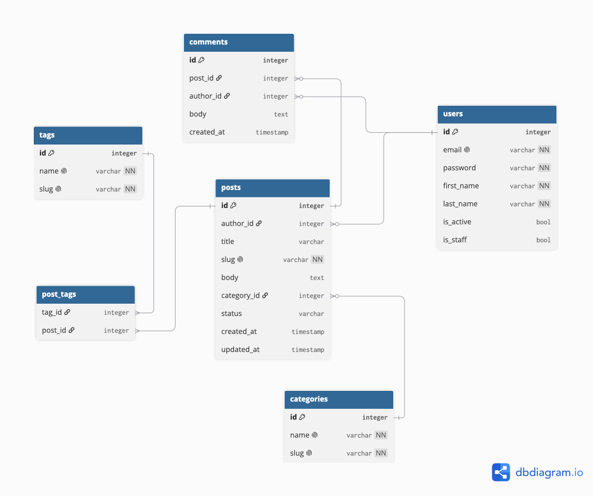

# Blog API

A blog backend built with Django.
Homework 1 for the course *Backend Framework. Django* (KBTU, Fall 2026).

This stage contains the project structure, environment-based settings,
a custom user model with email login, and the blog data models.

## Tech stack

- Python 3.13
- Django 6.1
- python-decouple — environment variables
- SQLite (local) / PostgreSQL (production)
- ruff — linter

## Database schema (ERD)



## Project structure

```
blog-api/
├── apps/
│   ├── auths/          # custom user model (email login)
│   └── blog/           # categories, tags, posts, comments
├── settings/
│   ├── .env.example    # template for environment variables
│   ├── conf.py         # reads .env
│   ├── base.py         # shared settings
│   ├── env/
│   │   ├── local.py    # DEBUG=True, SQLite
│   │   └── prod.py     # DEBUG=False, PostgreSQL
│   ├── urls.py
│   ├── wsgi.py
│   └── asgi.py
├── requirements/
│   ├── base.txt        # shared dependencies
│   ├── dev.txt         # development only
│   └── prod.txt        # production only
├── docs/
│   └── erd.png
├── logs/
└── manage.py
```

## Getting started

1. Clone the repository and create a virtual environment:
```bash
   git clone https://github.com/arailymkabykenova/blog-api.git
   cd blog-api
   python3 -m venv venv
   source venv/bin/activate
```

2. Install dependencies:
```bash
   pip install -r requirements/dev.txt
```

3. Create `settings/.env` from the template and set your own secret key:
```bash
   cp settings/.env.example settings/.env
```

4. Apply migrations and create an admin user:
```bash
   python manage.py migrate
   python manage.py createsuperuser
```

5. Run the development server:
```bash
   python manage.py runserver
```
   Admin panel: http://127.0.0.1:8000/admin/

## Environment variables

All variables use the `BLOG_` prefix.

| Variable | Description |
|---|---|
| `BLOG_SECRET_KEY` | Django secret key |
| `BLOG_ENV_ID` | `local` or `prod` — selects `settings/env/<value>.py` |

## Models

### `auths`
- **User** — logs in with email instead of username.
  The manager validates required fields, normalizes the email to lowercase
  and stores the password as a hash.

### `blog`
- **Category** — unique name and slug.
- **Tag** — unique name and slug.
- **Post** — author, title, unique slug, body, category, tags,
  status (`draft` / `published`), `created_at`, `updated_at`.
  - deleting the author deletes their posts (`CASCADE`);
  - deleting a category keeps the post and clears its category (`SET_NULL`);
  - a post can have many tags, a tag can belong to many posts (`ManyToMany`).
- **Comment** — belongs to a post and an author; deleted together with its post (`CASCADE`).

## AI usage

AI (Claude) was used for explanations of concepts and for code review.
The code and design decisions are my own.